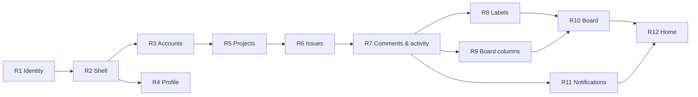

# One Team — epic roadmap (v1)

## 1. Authority and method

| | |
| --- | --- |
| **Epic** | One Team v1 — a self-hosted work tracker for one team under twenty people |
| **Source of truth** | [`docs/product/specifications.md`](product/specifications.md) — "One Team — product specification (v1)" |
| **Requirement IDs** | [`docs/product/requirements-index.md`](product/requirements-index.md) — derived, not authoritative |
| **This document** | The epic's decomposition. It names and orders sub-features; it does **not** design them. |
| **Method** | Spec Kit, [Spec of Specs](https://github.github.com/spec-kit/concepts/spec-of-specs.html). Each sub-feature runs its own specify → plan → tasks → implement cycle. |
| **Precedence** | Two axes. **What** is built: specification › this roadmap › child specs — where a child spec and this roadmap disagree, this roadmap is reconciled first (§5). **How** it is built: `AGENTS.md` and the constitution supersede all other practices, conventions and agent defaults; where those two disagree, `AGENTS.md` is primary. |
| **IDs** | `R1`…`R12` are immutable. An ID is never reused, renumbered or repurposed. A withdrawn sub-feature is struck, not deleted. |
| **Status vocabulary** | `planned` · `in-progress` · `done` |
| **Constitution** | [`.specify/memory/constitution.md`](../.specify/memory/constitution.md) — **v1.0.0**, ratified 2026-08-29. Governance, the amendment procedure, the version history and the project's decision records, plus pointers to the principles, technology constraints and change gates `AGENTS.md` now hosts. Both registers are cleared; the test-runner decision is recorded here instead, in `RD-004` (§6.2). It binds every child spec (§1.1); it does not govern this roadmap's decomposition. |
| **How it is built** | [`AGENTS.md`](../AGENTS.md) — the primary source. It hosts the seven core principles (numerals and names unchanged), the approved-dependency table, the eight change gates, and this project's runtime and framework guidance: Next.js 16 carries breaking changes, so framework-level code is checked against `node_modules/next/dist/docs/` rather than recalled API knowledge. |

No behaviour below is invented. Every scope boundary restates or defers something the specification states; gaps and contradictions are recorded in §6, not resolved.

### 1.1 Constitution gates

Constitution v1.0.0 changes nothing about the decomposition below — no slice is added, removed or reordered by it. It binds each child spec's plan and implementation through the eight change gates, which `AGENTS.md` now hosts and the constitution points to. Three of those shape how a slice is *specified*, not merely how its diff is reviewed:

- **Test-First (VII, non-negotiable)** — a failing test, observed failing for the intended reason, precedes every line of production code. A child spec's acceptance scenarios are therefore its Red step, written before implementation rather than recorded after it. The runner is Vitest, invoked by `npm test` (`RD-004`, resolved).
- **Built-in over third-party (IV)** — every dependency needs team approval recorded *before* it is installed. `AGENTS.md` carries that record as a table under Technology constraints, and it is the complete set: a library absent from it needs its own amendment (`RD-005` and `RD-006`, both resolved).
- **No speculative abstraction (I)** — a pattern must appear at two call sites before it is extracted. A slice that establishes an app-wide convention states the rule and implements it for its own first caller; the shared primitive is extracted when the second caller lands. This is why R7 delivers one feed component for both feeds, and why R2 ships no component library.

---

## 2. Sub-features

`Depends on` lists every slice this one consumes directly — a slice it reads tables, routes or conventions from. Some of those are also reachable transitively; §3's graph draws only the edges needed to fix the order, so the two lists differ by design. `Sub-spec` is filled in when the child spec directory is created (§4).

| ID | Sub-feature | Intent | Scope boundary | Requirements | Depends on | Status | Sub-spec |
|---|---|---|---|---|---|---|---|
| **R1** | Identity, sessions and sign-in | Stand the installation up and let an account holder in. | **Inherited from `main`:** the Drizzle + PostgreSQL pipeline — `src/db/index.ts`, `drizzle.config.ts`, `db:generate` / `db:migrate` — which R1 builds on rather than creates; R1 also deletes the placeholder `setup_check` table, which is dead code under Principle VI the moment real tables land. **In:** data-model conventions (UUIDv7, `text`+`CHECK`, `touched()`, length checks, the `publicUser` / `accountUser` projections, the read boundary); `user`, `credential`, `session`, `reset_token`, `auth_attempt`; Sign in §3.1 with its rejected, deactivated and throttled states; Forgot password; Change password (screen 13); the password policy; Argon2id; SHA-256 token digests; the sliding cookie; `loadActor()`; the origin check; the `auth_attempt` sweep and the single in-process timer that runs it; first-run seeding and the `must_change_password` banner; `admin:grant` and `admin:deactivate`, carrying the CLI-only `setUserRole` path and the `OT-INV-013` active-admin lock it shares with R3's `deactivateUser`; unauthenticated redirect to `/signin`. **Deferred:** `/invite/accept` and all invitation issuing (R3); Profile and its Change-password link (R4); the page sign-in lands on, and the shell that hosts the `must_change_password` banner on every screen (R2); the notification-mail half of the timer (R11). | `OT-SCOPE-006`, `OT-SEC-001`, `-002`, `-004`…`-012`, `-014`…`-019`, `OT-DATA-001`…`-003`, `-005`, `-006`, `OT-AUTHZ-004`, `-011`, `OT-OPS-003`, `-012`, `OT-INV-013`, `-016`, `-017` | — | `planned` | — |
| **R2** | Application shell and cross-cutting UX | Give every authenticated screen its frame, and fix the app-wide UX conventions once. | **In:** the 262px sidebar (app mark, Home, the project-list region and its admin-only `+` into Create project (hidden, not disabled, per `OT-UX-003`), Notifications, Accounts and Labels hidden for non-admins, user chip); the header contract (title block, one per-screen control slot, the New issue slot); the `must_change_password` banner slot every authenticated screen carries, rendering the banner R1 delivers; `/home` as a shell route rendering the sidebar **without** the header — `OT-UX-001`'s one exception, fixed here because it is a rule about the shell, not about Home; Forbidden §3.11; the "this doesn't exist" convention; hidden-not-disabled admin navigation; disabled-control-with-inline-reason; the React Aria first rule with Tailwind as visual layer only; the display-name rule; desktop-only with no breakpoint. **Fixed here as rules, not implemented here:** toasts, per-screen skeletons, re-query on navigation and the connection-lost banner — the shell has no writing or data-loading surface that exercises them. Each lands with the first slice that has one, R3 or R4 whichever is built first, so R2 states the rule and writes no code for it, and gate 1 asks for no test R2 cannot write. Under Principle I the shared primitive behind any convention is extracted at its second call site, so R2 ships no component library. **Deferred:** Home's content (R12); the project list's data and its ordering (R5); the Notifications unread count (R11); what the New issue slot points at (R6); every screen the sidebar links to. | `OT-SCOPE-004`, `-007`, `OT-UX-001`…`-007`, `-016`…`-019`, `-021`, `OT-SEC-015`, `OT-AUTHZ-005`, `-012` | R1 | `planned` | — |
| **R3** | Accounts and invitations | Populate the team — invite, accept, deactivate, reactivate. | **In:** `invite`; `/settings/accounts` with the Invitations and Accounts tabs; the Invite modal and `inviteUser`, `resendInvite`, `revokeInvite`; the 7-day single-use link; `/invite/accept` with its expired, used and unknown states; `deactivateUser` and `reactivateUser` with their confirmations; the last-active-admin guard; deactivation ending every session; the roster with role, joined date and project count. **Deferred:** role changes, which stay CLI-only; project membership (R5) — the roster's project count reads `project_member` rows and reads zero until then; each picker's exclusion of deactivated users takes effect as that picker lands (R5, R6, R7). | `OT-SEC-002`, `-003`, `-013`, `-016`, `OT-AUTHZ-006`, `-011`, `-014`, `OT-DATA-005`, `OT-UX-011`, `OT-INV-013` | R1, R2 | `planned` | — |
| **R4** | Profile | Let a signed-in user maintain their own record, and nobody else's. | **In:** `/profile`; in-place editing of avatar URL, first name, last name, job title, Slack handle, phone and bio; `updateOwnProfile`; email and account role shown as immutable values, not controls; the Change password link that reuses R1's request-and-token mechanism and throttle. **Deferred:** any route to view or edit another user's profile — none exists; role and email editing; `user.feed_filter`, which lands with the feed that uses it (R7). Editing your own profile writes no activity and notifies nobody. | `OT-AUTHZ-001`, `OT-DATA-005`, `-016`, `OT-UX-009`, `-010`, `-019`, `OT-SEC-004`, `-012` | R1, R2 | `planned` | — |
| **R5** | Projects — creation, record, membership and lifecycle | Create the container work lives in, decide who may write in it, and retire it. | **In:** `project`, `project_member`, `board_column` seeded with its five rows, `issue_counter`; the `isMember` predicate and the write boundary it draws; `createProject`, `updateProject`, `setProjectStatus`, `deleteProject`, `addProjectMember` and `removeProjectMember`; Create project §3.7 with the derived, immutable key and its uniqueness check, colour, dates and member chips; Project details §3.8 record section with in-place editing; the admin-only Status switch; the Members roster with add and remove; Delete, archived-only, with its cascade; the sidebar project list ordering; the project header with colour dot, name and the Board / Details tab pair. **Deferred:** column editing (R9) — the Columns section renders as the read-only list §3.8 already defines; the Activity section and the header's comment count (R7); activity records for every change on this screen (R7); the `notification` arm of `deleteProject`'s §4 cascade (R11), which lands with the table itself; the `/projects/:projectKey` board that the sidebar and the Board tab point at (R10). | `OT-SCOPE-002`, `OT-AUTHZ-001`, `-004`, `-006`, `-013`, `OT-DATA-007`, `-008`, `-013`, `-015`, `OT-UX-008`…`-012`, `-020`, `OT-OPS-010`, `-011`, `OT-INV-007`, `-008`, `-016` | R2, R3 | `planned` | — |
| **R6** | Issues — creation, detail and editing | Create a unit of work, open it at a shareable URL, and change every field on it. | **In:** `issue`; per-project numbering under a row lock and the permanent `WEB-142` key; Create issue §3.5 as a full page; Issue detail §3.4 as a full page with its 262px rail; in-place title and description editing; the basic-markdown subset stored as source; the rail's column, priority, assignee and due-date controls; `createIssue`, `updateIssue`, `deleteIssue`; the assignee pool of members plus every admin, deactivated excluded; the assigned-non-member state and its explanation. **Deferred:** the Labels field and the rail's label picker (R8); the Activity section (R7); the `notification` arm of `deleteIssue`'s §4 cascade, and every notification `createIssue` or `updateIssue` causes (R11); ordering semantics and drag (R10) — creation writes its initial `sort_order` at the foot of the project's order per `OT-DATA-018`, and nothing else in this slice touches ordering; the board (R10). **Blocked in part by** `RD-009`, which decides whether `createIssue` assigning someone notifies them. | `OT-SCOPE-003`, `OT-AUTHZ-007`, `-015`, `OT-DATA-004`, `-007`, `-008`, `-012`, `-015`, `-018`, `OT-UX-008`…`-011`, `-021`, `OT-INV-001`…`-004`, `-009` | R5 | `planned` | — |
| **R7** | Comments and activity feeds | Give projects and issues one shared, append-only history that people can talk in. | **In:** `comment`, `activity`, `user.feed_filter`; one feed component serving both §3.4 and §3.8 identically; the composer with `@mention` autocomplete built from Popover and ListBox, members and admins ranked first, deactivated excluded; `createComment`, `updateComment`, `deleteComment` with their authorship rules and cascades; the Comments only / All activity toggle remembered across both feeds; five-minute collapsing; 50-row pages appended on scroll; the project comment count in the header; the `#comment-<id>` anchor on every comment row, which R11's deep link targets; **and activity writing added to the R5 and R6 mutators**, in the same transaction as the change each describes. **Deferred:** every notification these events cause, and the `notification` arm of `deleteComment`'s §4 cascade (R11); label activity (R8); Home's cross-project roll-up (R12). Column activity stays R9's: R7 establishes the writer, R9 writes the five column events through it under `OT-DATA-019`. | `OT-AUTHZ-007`, `-008`, `-009`, `-014`, `OT-DATA-009`…`-011`, `-014`, `-016`, `OT-UX-013`…`-015`, `OT-INV-010`, `-011` | R5, R6 | `planned` | — |
| **R8** | Labels | One team-wide label set, curated by admins and applied by anyone who can write. | **In:** `label`, `issue_label`; `/settings/labels` with its alphabetical list and cross-project usage counts; the Create and Edit modals over the shared palette; `createLabel`, `updateLabel`, `deleteLabel` with its everywhere-at-once semantics and its counted confirmation; `addIssueLabel` and `removeIssueLabel`; the label pickers on the issue rail and on Create issue, with the admin-only "Manage labels" link hidden rather than disabled; `label_added` and `label_removed` activity, one row per label. **Deferred:** label chips on board cards (R10). Curating the set writes no activity, and a deletion writes none on the issues it is removed from — by §3.10, not by omission. | `OT-AUTHZ-010`, `OT-DATA-007`, `-008`, `-013`, `OT-UX-003`, `-011`, `-012`, `OT-INV-016` | R6, R7 | `planned` | — |
| **R9** | Board columns | Let an admin shape each project's columns without ever moving an issue. | **In:** `createColumn`, `updateColumn`, `moveColumn`, `deleteColumn`; add appends a column of kind `open`; inline rename and recolour from the palette; drag to reorder; the four delete refusals — non-empty, last column, last `canceled`-kind, last `done`-kind — each stating its own reason; case-insensitive name uniqueness as an inline error naming the existing column; `kind` fixed at creation; the per-column issue count; **and the activity records §3.8 requires for these five events**, written through the writer R7 establishes. **Deferred:** the board's rendering of the result (R10). | `OT-AUTHZ-001`, `OT-DATA-013`, `OT-DATA-019`, `OT-UX-012`, `OT-OPS-010`, `OT-INV-005`, `-006`, `-012`, `-014`, `-015`, `-016` | R5, R6, R7 | `planned` | — |
| **R10** | Board — grouping, drag and ordering | The Trello surface: the project's main screen and the app's centre of gravity. | **In:** `/projects/:projectKey`; columns as lists of cards and the card face; Column, Assignee and Priority grouping with Unassigned first; drag to move and to reorder; `moveIssue` writing one base-62 fractional index plus whichever field the grouping represents; one order per project with ties legal and `(sort_order, id)` as the sort; the inline "Add a card" composer and the chevron into R6's Create issue page; optimistic drag with last-write-wins; re-query on focus and every 30 seconds, including mid-drag. **Deferred:** locking, live push and real-time collaboration — out of scope by §1; every notification `moveIssue` or the inline composer causes (R11, pending `RD-009`); the progress figure that reads `done` and `canceled` kinds (R12). **Blocked in part by** `RD-009`, which decides whether a cross-lane drop under Assignee grouping notifies the new assignee — and so whether R11 must reach back into `moveIssue`. | `OT-SCOPE-004`, `OT-AUTHZ-007`, `-015`, `OT-DATA-017`, `-018`, `OT-UX-008`, `-021`, `OT-OPS-008`, `-009`, `-011`, `OT-INV-004` | R6, R8, R9 | `planned` | — |
| **R11** | Notifications and email | Tell people the three things worth interrupting them for, in the app and by mail. | **In:** `notification`; `markNotificationRead`; `/notifications` with the unread dot, actor, type, target and relative time, and the deep link to the `#comment-<id>` anchor R7 emits; "Mark all read"; the sidebar's unread count; recipient computation for `mention`, `assignment` and `comment` **added to R6's `updateIssue` and R7's `createComment`**, and to whichever further assigning mutators `RD-009` names; **the `notification` arm of the §4 cascades added to R5's `deleteProject`, R6's `deleteIssue` and R7's `deleteComment`**; the actor removed from every recipient set; mention winning over comment; the row written in the causing transaction; mail sent after that transaction commits, one message per notification; `emailed_at`, three retries over an hour, sharing R1's timer. **Deferred:** digests, batching and opt-out — none in v1; status changes and activity records notify nobody. **Blocked in part by** `RD-009`. | `OT-AUTHZ-003`, `OT-DATA-009`, `-011`, `OT-OPS-001`…`-007`, `OT-INV-010` | R5, R6, R7 | `planned` | — |
| **R12** | Home roll-up | One read-only landing page answering "what is mine, and what just happened". | **In:** `/home`'s content — the greeting, the three stat cards, Assigned to you, Your projects with the progress figure and its zero-denominator rule, Mentions, and Recent activity as the 20 most recent rows across every project and issue feed — all of it inside the headerless `/home` route R2 already delivers. The unread stat card and Mentions both read `notification`, so `OT-AUTHZ-003`'s own-`user_id` rule binds Home whatever `RD-003` decides. The progress formula and its zero-denominator rule are §3.2 behaviour with no index ID — the index extracts only rules spanning two or more capabilities — and R12 reads `done`- and `canceled`-kind columns without enforcing `OT-INV-014`, which is `deleteColumn`'s and stays R9's. **Deferred:** no writes and no new mutators — Home reads only. **Blocked in part by** `RD-003` (§6.2), which decides what the Mentions section reads. | `OT-AUTHZ-002`, `-003`, `OT-DATA-004`, `OT-UX-001`, `-005`…`-007` | R7, R10, R11 | `planned` | — |

### Cross-cutting requirements

These are first fixed by the slice named and then hold for **every** later slice; the attribution decides where the convention is established, not who may cite it — a later row still names one where it materially exercises it (`OT-DATA-005` in R3 and R4, `OT-UX-008` in R6 and R10).

The attributions: `OT-DATA-001`…`-003` and `OT-DATA-005`, `-006` (R1); `OT-AUTHZ-004` (R1), `-005`, `-012` (R2); `OT-UX-002`, `-005`…`-007`, `-016`…`-019` (R2); `OT-UX-008` (R5); `OT-SCOPE-001`, `-005` (the whole epic — no slice may build an out-of-scope feature).

---

## 3. Dependency order



The graph is the transitive reduction: it draws the minimum edges that fix the build order, while §2's `Depends on` column names every slice a row consumes directly, including ones the graph reaches through an intermediate. Neither is stricter than the other — the graph decides order, the column decides what a child spec must read.

R4 sits off the critical path and may be built in parallel with R3 or later. R8 and R9 are independent of each other and may be built in parallel once R7 lands.

Two slices carry work back into earlier ones, deliberately, because the specification requires the behaviour to be transactional with the change it describes rather than bolted on afterwards:

- **R7** adds activity writing to the project and issue mutators delivered in R5 and R6.
- **R11** adds recipient computation to `updateIssue` (R6) and `createComment` (R7); adds the `notification` arm of the §4 cascades to `deleteProject` (R5), `deleteIssue` (R6) and `deleteComment` (R7), each of which §4 already specifies as reaching notifications; and adds the mail sweep to the timer R1 already runs.

`RD-009` may extend R11's first back-edge to `moveIssue` (R10) and `createIssue` (R6). If it does, R11 gains R10 as a direct dependency and the graph above gains an `R10 --> R11` edge; it is the only open decision that can change the build order rather than a slice's contents.

Any child spec for R5, R6 or R7 must state that these later slices will touch its mutators and its deletes.

---

## 4. Linking contract

Linking is bidirectional and plain-text — no tooling required.

**Child → parent.** Every child `spec.md` carries the parent and its entry ID in the header block, immediately under `**Feature Branch**`:

```markdown
**Parent roadmap**: `docs/ROADMAP.md` → entry **R5**
```

**Parent → child.** When a child spec directory is created, its path replaces the `—` in that row's `Sub-spec` column, as a link:

```markdown
[`specs/005-projects/`](../specs/005-projects/)
```

Child specs live under `specs/<NNN>-<short-name>/`, numbered sequentially by `.specify/scripts/bash/create-new-feature.sh`. Roadmap IDs are **not** the directory numbers: `R5` is the immutable identity, `005-` is whatever the script assigns. Keep the two mapped only through the `Sub-spec` column.

The roadmap is accepted, so child specs may be created; none exists yet. `.specify/templates/spec-template.md` carries the `**Feature Branch**` line but no parent-roadmap line, so the author adds that line by hand.

---

## 5. Scope changes

1. **Amend the roadmap first.** It is the source of truth for decomposition.
2. **Then reconcile affected child specs**, in dependency order, and note the reconciliation in each.
3. **Never renumber.** Withdraw an entry by striking its row and setting its status; add new work as a new ID (`R13`, `R14`, …).
4. **Recurse when a slice stays too large.** If a sub-feature cannot be specified as a single coherent outcome, give it its own roadmap at `specs/<NNN>-<short-name>/roadmap.md` with its own immutable IDs, and leave this entry pointing at that directory.
5. **A change to `docs/product/specifications.md` outranks all of the above** — this roadmap is reconciled to the specification, never the reverse.

---

## 6. Blocking decisions

Not resolved here. An open entry belongs to the specification's owner — or, in §6.2, to whoever owns the document it contradicts — and names the slice it blocks.

### 6.1 Inherited from the requirements index

Full statements in [`docs/product/requirements-index.md` §5](product/requirements-index.md).

| ID | Conflict or gap, in brief | Blocks |
|---|---|---|
| `OT-DEC-001` | ~~Column lifecycle activity has no representation in the `activity` schema.~~ **Resolved** 2026-08-29 — the `type` enum widens by five `column_` values and `field` carries the board column's frozen name, leaving the value pair for the transition where the change has one. Indexed as `OT-DATA-019`. | None — closed. |
| `OT-DEC-002` | ~~`member_added` / `member_removed` value encoding is undefined.~~ **Resolved** 2026-08-29 — the value pair holds that member's display name as a frozen string, exactly as the label types hold a label's, with `field` unused. Indexed as `OT-DATA-020`. | None — closed. |
| `OT-DEC-003` | ~~"New issue" visibility for a non-member — hidden, disabled-with-reason, or enabled-then-403.~~ **Resolved** 2026-08-29 — every entry point renders disabled with an inline reason naming the project, and the route still answers Forbidden to a caller who reaches it directly; the two are independent. Indexed as `OT-UX-021`. | None — closed. |
| `OT-DEC-004` | ~~Whether a project-comment notification reaches every admin.~~ **Resolved** 2026-08-29 — it reads `project_member` rows only, a membership list rather than the predicate, so an admin receives one only where they were added explicitly. Indexed as `OT-OPS-014`. | None — closed. |
| `OT-DEC-005` | ~~Whether editing a comment notifies newly added mentions.~~ **Resolved** 2026-08-29 — an edit writes a `mention` row for each user the saved body names and the replaced body did not, and withdraws nothing. Indexed as `OT-OPS-013`. | None — closed. |
| `OT-DEC-006` | ~~Whether reset requests share the sign-in throttle counter.~~ **Resolved** 2026-08-27 — sign-in and reset count in separate `auth_attempt` buckets under the same limits, discriminated by a new `flow` column. Indexed as `OT-SEC-017`. | None — closed. |
| `OT-DEC-007` | ~~"Mark all read" has no mutator in the §2 inventory.~~ **Resolved** 2026-08-29 — `markAllNotificationsRead` joins the requires-only-self row and clears the caller's unread rows in one statement. Indexed as `OT-AUTHZ-016`. | None — closed. |
| `OT-DEC-008` | ~~The deactivated sign-in message "names an admin" — which admin, and may it be disclosed unauthenticated.~~ **Resolved** 2026-08-27 — it names the operator-configured `SUPPORT_EMAIL` and reads no `user` row, naming none where the operator has set none. Indexed as `OT-SEC-018`. | None — closed. |
| `OT-DEC-009` | ~~Whether the seeded `ADMIN_PASSWORD` is subject to the password policy.~~ **Resolved** 2026-08-27 — it is; a non-compliant value refuses the seed and names the rule it broke. Indexed as `OT-SEC-019`. | None — closed. |

### 6.2 Surfaced by this decomposition

RD IDs are append-only: a resolved entry keeps its row and its ID.

| ID | Conflict or gap | Source | Impact if unresolved | Status |
|---|---|---|---|---|
| `RD-001` | ~~**The project constitution is an unratified template.**~~ **Resolved** by the constitution's ratification — seven principles plus Technology Constraints, Development Workflow and Governance. The plan-phase gate now has content to check against. Ratification introduced two constraints of its own, recorded below as `RD-004` and `RD-005`. | `.specify/memory/constitution.md` | None — closed. | `resolved` |
| `RD-002` | ~~**Where a newly created issue lands in the order is unspecified.**~~ **Resolved** 2026-08-27 by amendment to specification §3.3 (*Creation*) and §3.5 (*Ordering*), indexed as `OT-DATA-018`: `createIssue` writes an index after every existing issue in the project, so a new issue is last in the single project-wide sequence and therefore last in whatever column, assignee or priority lane it lands in. Chosen over placing it relative to its column because only a globally-last index puts the new card where the composer that made it sits under all three groupings. Scoping the order per column, or one index per grouping axis, was considered and rejected — either is a change to `OT-DATA-017`'s one-order-per-project model, not a resolution of this gap. | §3.3 (lines 157, 163–167), §3.5 (line 201) | None — closed. | `resolved` |
| `RD-003` | **Home's "Mentions" section has no defined source.** §3.2 lists it among Home's sections without saying what it reads — unread `mention` notifications, all `mention` notifications, or comments carrying the viewer's token — nor how many rows, nor whether read ones persist. Every other Home section is given its query or its formula. | §3.2 (line 146) vs §3.6 (lines 207–209) | Blocks R12's Mentions query. Notifications are readable only by their own `user_id` (`OT-AUTHZ-003`), so the choice also decides whether Home reads the notification table at all. | `open` |
| `RD-004` | ~~**No test runner is configured, and Principle VII is non-negotiable.**~~ **Resolved** by constitution amendment: Vitest adopted as the single runner for both server logic and component behaviour, with `npm test` wired into CI. `node:test` was rejected on evidence — Node strips TypeScript types but does not transform JSX, so it cannot execute a `.tsx` test (`ERR_UNKNOWN_FILE_EXTENSION`), and `OT-UX-018` makes React Aria keyboard, focus and ARIA behaviour testable surface the team owns. Original finding: `package.json` on `main` carries no `test` script and no test framework. The constitution flags this against itself as `TODO(TEST_RUNNER)` and states that Principle VII cannot be enforced in CI until the team selects one. Principle VII forbids writing any production code without a test first observed failing for the intended reason, and Development Workflow gate 1 requires a reviewer to see that evidence. Under Principle IV, Node's built-in `node:test` is the preferred candidate; anything else needs recorded approval. | Constitution — Principle VII, Technology Constraints, Development Workflow gate 1 — vs `package.json` | Blocks the implement phase of **every** slice, R1 first: there is no way to produce a Red step, so no production code may be written at all. Closed — R1 may now be planned. | `resolved` |
| `RD-005` | ~~**The specification's stack is not the constitution's approved stack.**~~ **Resolved** by the same amendment, which records an approved-dependency table in Technology Constraints covering the specification's §7 stack — Drizzle, React Aria, `@node-rs/argon2`, `nodemailer`, `uuidv7`, `fractional-indexing` — plus the already-installed set and the testing stack. Original finding: Technology Constraints names Next.js 16, React 19, TypeScript, Tailwind v4 and Biome, and Principle IV requires team approval recorded *before* any further dependency is added. Specification §7 mandates Drizzle ORM, PostgreSQL, `@node-rs/argon2`, `nodemailer`, `uuidv7`, `fractional-indexing` and React Aria Components — none of them named in that section. `react-aria-components`, `drizzle-orm`, `postgres`, `drizzle-kit`, `@next/env` and `server-only` are already installed on `main` without the section being amended. | Constitution — Principle IV, Technology Constraints — vs specification §7 | Blocks R1 at the point it installs `@node-rs/argon2`, `nodemailer` and `uuidv7`, and R10 at `fractional-indexing`, and leaves the already-installed set unrecorded. Closed — R1 and R10 install against a recorded approval. | `resolved` |
| `RD-006` | ~~**An installed dependency is absent from the approved set.**~~ **Resolved** by constitution amendment, which records `babel-plugin-react-compiler` in the approved-dependency table. Approved rather than removed: the React Compiler is a first-party React capability reached through a Next.js configuration flag, and the package is Next's own optional peer dependency — not a library chosen in place of a built-in — and as a devDependency it runs at build time and adds nothing to the production bundle. Removing it would have deleted a working framework feature for bookkeeping reasons. Original finding: the plugin is in `package.json` and enabled by `reactCompiler: true` in `next.config.ts`, but appeared nowhere in Technology Constraints — neither in its prose stack line nor in the approved-dependency table that `RD-005` added — while Principle IV requires approval recorded *before* installation and the table states it is the complete set, so the two disagreed about a dependency already running. | Constitution — Principle IV, Technology Constraints — vs `package.json`, `next.config.ts` | None — closed. | `resolved` |
| `RD-007` | ~~**What a successful sign-in clears is unspecified.**~~ **Resolved** 2026-08-27 by the same amendment that closed `OT-DEC-006`, under `OT-SEC-017`: a success clears that address's `signin` rows and nothing else. Original finding, surfaced while amending the very sentence `OT-DEC-006` required: §6 counts a sign-in against two subjects — the address and the request's IP — but said only that "a successful sign-in clears that subject's rows". Read generically that clears both, which lets anyone holding one valid credential reset the per-IP counter at will and guts the twenty-per-IP rule; read as the address alone, the IP rule survives. The source chose neither. | Specification §6 (*Throttle*), §5 (`auth_attempt`) | None — closed. | `resolved` |
| `RD-008` | ~~**`admin:grant`'s password source and policy status are unspecified.**~~ **Resolved** 2026-08-27 by amendment to specification §6 (*Break-glass*), under `OT-SEC-019`: the password is prompted for and read from the terminal, never passed as a flag — the command runs over SSH, where an argument would land in shell history and the process table — and a value failing the policy is refused. Original finding, surfaced by resolving `OT-DEC-009`: §6 says the command "sets a password" while its own signature carries only `--email`, `--first-name` and `--last-name`, so neither the value's source nor its policy status was stated, though `OT-SEC-004` claims the policy holds at every entry point. | Specification §6 (*Break-glass*) vs §3.1 (password policy) | None — closed. | `resolved` |
| `RD-009` | **Which mutators fire an `assignment` notification is unspecified.** §3.6 states that "an `assignment` goes to the new assignee" and never names a mutator, but three paths write `issue.assignee_id`: `updateIssue` from the issue rail; `moveIssue` on a cross-lane drop under Assignee grouping, which §3.3 says writes "whichever field the current grouping represents — column, assignee, or priority"; and `createIssue`, from Create issue's Assignee field and from the board's inline composer, which §3.3 says "carries the assignee … its drop column represents". The source classifies none of the three. | §3.6 (line 209) vs §3.3 (lines 157, 163), §3.4 (line 182), §3.5 (line 196) | Blocks R11's recipient computation, which today names `updateIssue` alone. Dragging is the board's primary gesture, so `moveIssue` is plausibly the highest-volume assignment path in the product; resolving by silence means a card dropped into someone's lane assigns them and tells them nothing. If `moveIssue` fires it, R11 must reach back into R10's mutator, gaining R10 as a direct dependency and adding an `R10 --> R11` edge to §3 — the only open decision that can change the build order. If `createIssue` fires it, R11 also reaches back into R6. | `open` |

---

## 7. Status log

| Date | Change |
|---|---|

*No entries.*

---

*Decomposition of `docs/product/specifications.md`. Roadmap IDs are immutable and append-only.*
