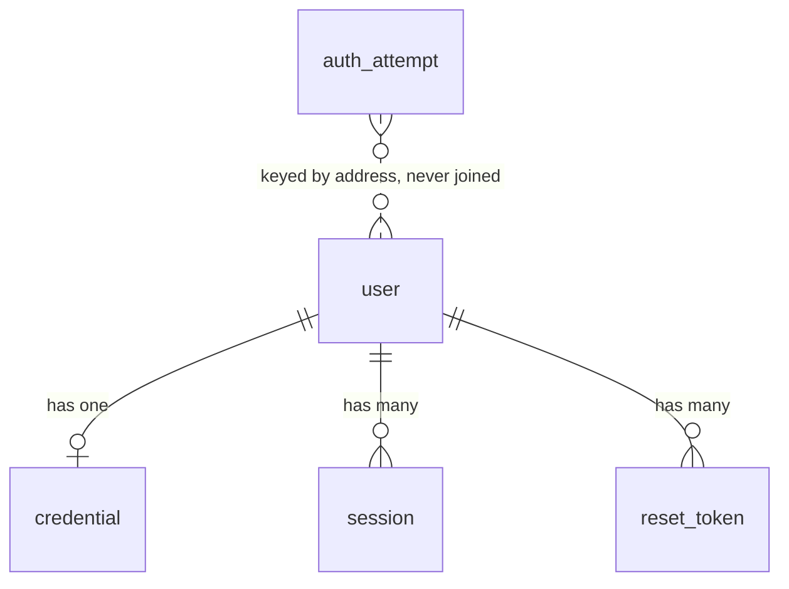

# Phase 1 data model — R1: identity, sessions and sign-in

**Plan**: [`plan.md`](./plan.md) · **Spec**: [`spec.md`](./spec.md) · **Research**: [`research.md`](./research.md)

Five tables, all new, plus the removal of the inherited `setup_check` placeholder (`FR-008`). Every
convention below restates §5 of [`docs/product/specifications.md`](../../docs/product/specifications.md)
or a decision recorded in [`research.md`](./research.md); nothing is invented here.

The whole set lands in `src/db/schema.ts`, which `drizzle.config.ts` names directly — splitting it
would mean editing that config in the same change (AGENTS.md).

---

## Conventions this feature establishes

Every later slice inherits these. They are `FR-001` through `FR-004` and `OT-DATA-001`…`-003`, `-005`.

| Convention | Rule |
| --- | --- |
| Primary keys | `uuid`, server-generated with `uuidv7()` at the application boundary. No database default, no `serial`. |
| Enumerations | `text` with a `CHECK` constraint. Never `pgEnum` — widening a `CHECK` is an ordinary transactional migration. |
| Instants | `timestamptz`. Application logic is UTC; calendar comparison uses the operator's server timezone. |
| Free text | Every column bounded by a `CHECK`: **200** for names and handles, **10 000** for long free text, and the three exceptions research records (C-2, C-3, C-4). |
| `updated_at` | Written explicitly by every mutator through one `touched()` helper. Never a trigger. Present on the tables that are edited (C-1). |
| Naming | `snake_case`, singular table names. |
| Read boundary | `user` is read through `publicUser`; contact fields only through `accountUser`. `credential`, `session`, `reset_token` and `auth_attempt` are unreachable from any read endpoint (`FR-005`). |

---

## `user`

A person who may sign in. **Never deleted** (`FR-007`, `OT-INV-017`) — closing an account sets
`deactivated_at` and nothing else.

| Column | Type | Constraints |
| --- | --- | --- |
| `id` | `uuid` | PK, UUIDv7 |
| `first_name` | `text` | `NOT NULL`, `CHECK ≤ 200` |
| `last_name` | `text` | `NOT NULL`, `CHECK ≤ 200` |
| `email` | `text` | `NOT NULL`, `CHECK ≤ 200`, `UNIQUE (lower(email))` |
| `avatar_url` | `text` | `CHECK ≤ 2000` (research C-4) |
| `role` | `text` | `NOT NULL DEFAULT 'member'`, `CHECK (role IN ('admin','member'))` |
| `job_title` | `text` | `CHECK ≤ 200` |
| `slack_handle` | `text` | `CHECK ≤ 200` |
| `phone` | `text` | `CHECK ≤ 200` |
| `bio` | `text` | `CHECK ≤ 10000` |
| `deactivated_at` | `timestamptz` | null means active |
| `must_change_password` | `boolean` | `NOT NULL DEFAULT false` |
| `feed_filter` | `text` | `NOT NULL DEFAULT 'all'`, `CHECK (feed_filter IN ('comments','all'))` |
| `created_at` | `timestamptz` | `NOT NULL` |
| `updated_at` | `timestamptz` | `NOT NULL`, written by `touched()` |

**Validation at the boundary** (`FR-006`, Principle II). An address is validated as an address and
folded to lower case before it is written, at every entry point that writes one: first-run seeding,
`admin:grant`, and — from R3 — invitation. The unique index folds case, so the database is the
backstop rather than the only check.

**Written by this feature.** First-run seeding (`FR-045`), `admin:grant` (`FR-051`),
`admin:deactivate` (`FR-054`), and the flag clear a completed reset performs (`FR-050`).
No screen this feature delivers writes a `user` row, and none sets `role` (`FR-055`).

**`feed_filter` is created here and used by no one until R7.** §5 places it on `user` and this
feature owns the table; R7 delivers the toggle that reads it.

### Projections (`FR-004`, `OT-DATA-005`)

Two, and no endpoint selects the table directly.

| Projection | Columns | Who may use it |
| --- | --- | --- |
| `publicUser` | `id`, `first_name`, `last_name`, `avatar_url`, `role`, `job_title`, `deactivated_at` | every read endpoint in the product |
| `accountUser` | `publicUser` **+** `email`, `slack_handle`, `phone`, `bio` | the admin Accounts screen (R3), and a user reading their own row (R4) |

Neither carries a password — the hash is not on this record at all. No unauthenticated route selects
either projection (`FR-015`, `OT-SEC-018`): the deactivated sign-in message names `SUPPORT_EMAIL`
from the environment, never a value read from a row.

---

## `credential`

One user's Argon2id hash, held apart from `user` so it can never be selected into a response
(`FR-028`, `OT-SEC-005`).

| Column | Type | Constraints |
| --- | --- | --- |
| `id` | `uuid` | PK, UUIDv7 |
| `user_id` | `uuid` | `NOT NULL`, `UNIQUE`, `REFERENCES user(id) ON DELETE CASCADE` |
| `password_hash` | `text` | `NOT NULL` |
| `created_at` | `timestamptz` | `NOT NULL` |
| `updated_at` | `timestamptz` | `NOT NULL`, written by `touched()` |

`UNIQUE (user_id)` makes "one credential per user" structural. The cascade is declared and
unreachable — `FR-007` means no path deletes a `user` row.

**Written by** seeding, `admin:grant`, and a completed reset. **Read by** sign-in only, and only to
verify. The hash never appears in a response, a cookie or a log.

---

## `session`

One live sign-in. Addressed by an opaque identifier whose SHA-256 digest is what is stored
(`FR-029`, `OT-SEC-006`), so a leaked database yields no working cookie.

| Column | Type | Constraints |
| --- | --- | --- |
| `id` | `uuid` | PK, UUIDv7 |
| `user_id` | `uuid` | `NOT NULL`, `REFERENCES user(id) ON DELETE CASCADE`, indexed |
| `token_digest` | `text` | `NOT NULL`, `UNIQUE`, `CHECK (char_length = 64)` |
| `created_at` | `timestamptz` | `NOT NULL` |
| `last_seen_at` | `timestamptz` | `NOT NULL` |
| `expires_at` | `timestamptz` | `NOT NULL` |
| `user_agent` | `text` | `CHECK ≤ 1000` (research C-3) |
| `ip_address` | `text` | `NOT NULL`, `CHECK ≤ 45` (research C-3) |

**Fields fixed by §6** — user, created, last-seen, expiry, user-agent, IP. No `updated_at`:
`last_seen_at` carries that meaning (research C-1).

### Lifecycle

| Event | Effect |
| --- | --- |
| Successful sign-in | one row inserted; `expires_at = now + 30 days` (`FR-016`, `FR-017`) |
| Any authenticated request | `last_seen_at = now`, `expires_at = now + 30 days` — sliding, refreshed on use |
| Completed password reset | **every** row for that user deleted, including the requesting one (`FR-038`, `OT-SEC-012`) |
| `admin:deactivate` | every row for that user deleted (`FR-054`, §6) |
| Past `expires_at` | resolves to no actor (`FR-021`); swept only by expiry, not by the timer |

### Resolution (`FR-020`, `OT-SEC-008`)

`loadActor()` hashes the cookie value, looks the row up by `token_digest`, and joins `user` in the
**same query** to read `role` and `deactivated_at`. Three cases resolve to no actor: no row, past
expiry, and a user whose `deactivated_at` is set. Nothing about identity, role or membership is
cached between requests.

---

## `reset_token`

A single-use grant to set one user's password.

| Column | Type | Constraints |
| --- | --- | --- |
| `id` | `uuid` | PK, UUIDv7 |
| `user_id` | `uuid` | `NOT NULL`, `REFERENCES user(id) ON DELETE CASCADE`, indexed |
| `token_digest` | `text` | `NOT NULL`, `UNIQUE`, `CHECK (char_length = 64)` |
| `expires_at` | `timestamptz` | `NOT NULL` — one hour after issue (spec assumption) |
| `used_at` | `timestamptz` | null until spent |
| `created_at` | `timestamptz` | `NOT NULL` |

### The four states a token can be in (`FR-036`, `FR-037`, `OT-SEC-016`)

| State | Determined by | Screen |
| --- | --- | --- |
| Valid | row exists, `used_at IS NULL`, `expires_at > now` | the two-field form |
| Used | `used_at IS NOT NULL` | its own explanation |
| Expired | `used_at IS NULL` and `expires_at <= now` | its own explanation |
| Unknown | no row for the digest | its own explanation |

**Used is checked before expired** (research C-8), so a token that is both reports used.

**Spending is atomic.** `UPDATE reset_token SET used_at = now() WHERE id = $1 AND used_at IS NULL`
inside the same transaction as the password write and the session deletion; zero rows affected means
the token was spent concurrently and the whole transaction rolls back. `FR-037`'s "exactly once"
is enforced by that predicate, not by a prior read.

**Sibling tokens are not withdrawn.** Two outstanding tokens for one address stay independently
usable until each expires or is used — the specification makes each single-use and says nothing
about withdrawing the other (spec assumption).

---

## `auth_attempt`

The durable counter behind both throttles (`FR-039`…`FR-044`, `OT-SEC-010`, `OT-SEC-017`).
**Never read by any screen** (`FR-005`).

| Column | Type | Constraints |
| --- | --- | --- |
| `id` | `uuid` | PK, UUIDv7 |
| `flow` | `text` | `NOT NULL`, `CHECK (flow IN ('signin','reset'))` |
| `kind` | `text` | `NOT NULL`, `CHECK (kind IN ('email','ip'))` |
| `subject` | `text` | `NOT NULL`, `CHECK ≤ 200` — the lowercased address, or the IP |
| `attempted_at` | `timestamptz` | `NOT NULL` |

**Fields fixed by §5** — flow, kind, subject, attempted_at. No `created_at` / `updated_at` pair:
rows are inserted and swept, never edited (research C-1).

### Counting rules

| Rule | Source |
| --- | --- |
| Counted over the last **fifteen minutes** for one `(flow, kind, subject)` taken together | `FR-042` |
| Sign-in refuses at **5** for `kind = 'email'`, **20** for `kind = 'ip'` | `FR-039` |
| Reset uses the **same two limits and window**, in its own `flow` | `FR-040` |
| A sign-in records a row **only when it fails** | `FR-041` |
| A reset request records a row **every time**, success or not | `FR-032` |
| A successful sign-in clears that address's `('signin','email')` rows **only** | `FR-018` |
| Rows past the window are removed by the sweep | `FR-044` |

The two flows never share a counter, which is what makes `SC-007` true in both directions: a reset
lockout cannot block sign-in, and a sign-in lockout cannot block the reset that would fix it.

### Concurrency

The count, the refusal decision and the failure insert run in one transaction holding
`pg_advisory_xact_lock` keyed on `(flow, kind, subject)` (research C-5), so two attempts racing the
fifth failure cannot both pass. The sweep needs no lock: its predicate can only match rows already
outside every live window (research C-6).

---

## Removed

### `setup_check`

Dropped, together with its entry in `src/db/schema.ts` (`FR-008`). It is the create-next-app
placeholder inherited from `main` and is dead code under Principle VI the moment real tables exist.
The drop and the five creations are one generated migration (research C-10).

---

## Relationships

`auth_attempt` deliberately holds no foreign key: it counts attempts against addresses that may have
no account at all, which is what stops the throttle becoming an account-existence oracle (`FR-032`,
edge case *an address that has never had an account*).

---

## Invariants this feature enforces

| # | Invariant | Enforced by |
| --- | --- | --- |
| `OT-INV-016` | An address is unique when folded to lower case | `UNIQUE (lower(email))` |
| `OT-INV-017` | No path deletes a `user` row | no delete mutator exists; closing sets `deactivated_at` |
| `OT-INV-013` | At least one admin is always active | `SELECT … FOR UPDATE` on the active-admin set, in the same transaction as the change (research C-7) |
| `FR-037` | A reset token is usable exactly once | conditional `UPDATE … WHERE used_at IS NULL` |
| `FR-039` | The fifth failure is the last one that passes | advisory lock over count-and-insert (research C-5) |
| `FR-005` | Auth tables are unreachable from a read endpoint | no query outside `src/features/auth/server/` names them; asserted by test |

---

## Types at the boundary

Persistence types are derived with `$inferSelect` / `$inferInsert`, and **no database row is exposed
as a UI or API model** (AGENTS.md). The DTOs this feature defines:

| DTO | Shape | Crosses |
| --- | --- | --- |
| `Actor` | `{ id, role, firstName, lastName }` — resolved fresh per request, never a table | server only; passed to every read and mutator |
| `PublicUser` | the `publicUser` projection | server → client, from R2 onward |
| `SignInResult` | a discriminated union: `ok` · `rejected` · `deactivated` · `throttled` | the `POST /api/auth/signin` response body |
| `PasswordPolicyFailure` | `'too_short'` \| `'blocklisted'` | Server Action results and CLI output |
| `ResetTokenState` | `'valid'` \| `'used'` \| `'expired'` \| `'unknown'` | the change-password page |

`SignInResult`'s `rejected` variant carries no discriminator distinguishing a wrong password from an
unknown address — the union has no shape in which that difference could be expressed, which is how
`FR-013` and `SC-003` are held by the type rather than by discipline.
